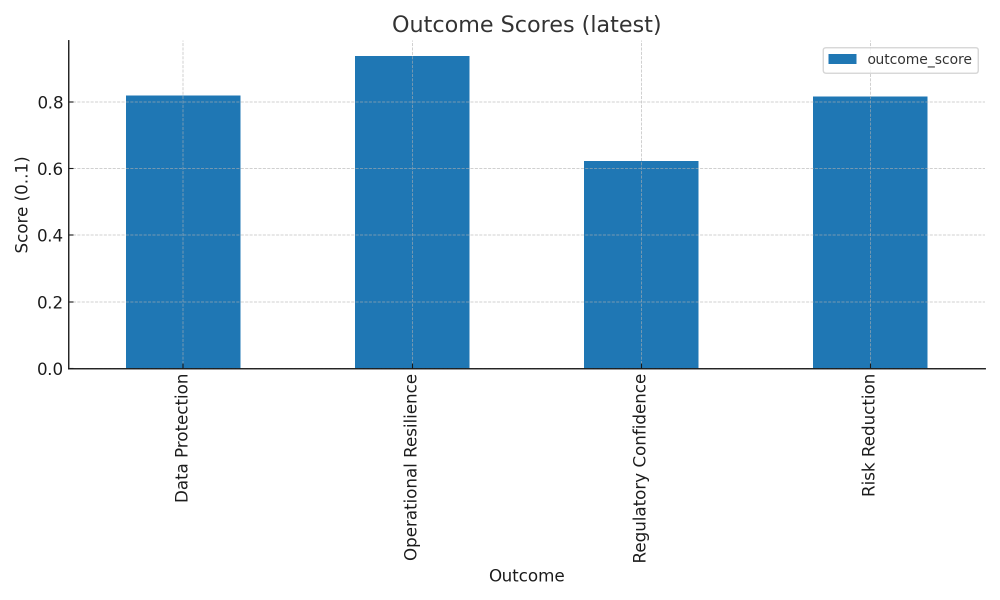
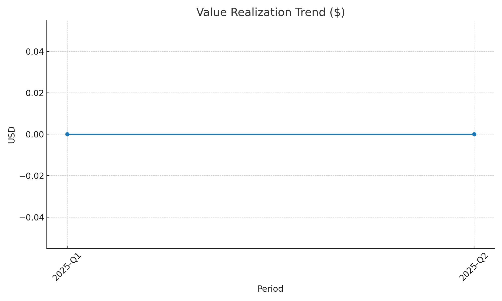
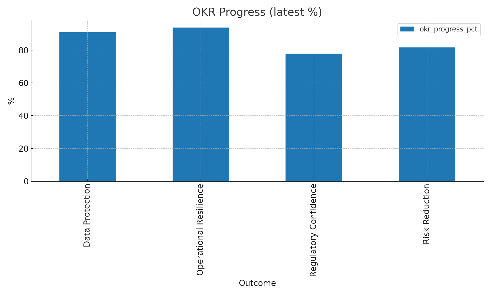

# CyberODM — Outcome‑Driven Metrics Report

## Snapshot (latest)

| outcome_id   | name                   | owner     |   outcome_score | rag   |   okr_progress_pct |   value_realization_usd |
|:-------------|:-----------------------|:----------|----------------:|:------|-------------------:|------------------------:|
| DP           | Data Protection        | M. Khan   |        0.819211 | Green |            91.0234 |                       0 |
| OR           | Operational Resilience | J. Nguyen |        0.938723 | Green |            93.8723 |                       0 |
| RC           | Regulatory Confidence  | S. Lee    |        0.623626 | Amber |            77.9532 |                       0 |
| RR           | Risk Reduction         | A. Patel  |        0.816667 | Green |            81.6667 |                       0 |

## Value Realization (by period)

| outcome_id   | period   |   value_realization_usd |
|:-------------|:---------|------------------------:|
| DP           | 2025-Q1  |                       0 |
| DP           | 2025-Q2  |                       0 |
| OR           | 2025-Q1  |                       0 |
| OR           | 2025-Q2  |                       0 |
| RC           | 2025-Q1  |                       0 |
| RC           | 2025-Q2  |                       0 |
| RR           | 2025-Q1  |                       0 |
| RR           | 2025-Q2  |                       0 |

## Top 5 Gaps

| outcome_id   | name                   | owner     |   outcome_score |   okr_progress_pct |
|:-------------|:-----------------------|:----------|----------------:|-------------------:|
| RC           | Regulatory Confidence  | S. Lee    |        0.623626 |            77.9532 |
| RR           | Risk Reduction         | A. Patel  |        0.816667 |            81.6667 |
| DP           | Data Protection        | M. Khan   |        0.819211 |            91.0234 |
| OR           | Operational Resilience | J. Nguyen |        0.938723 |            93.8723 |

## Charts

